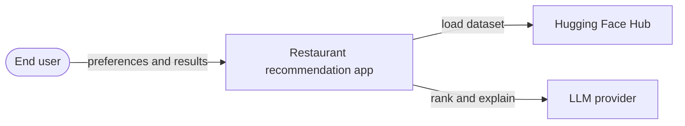
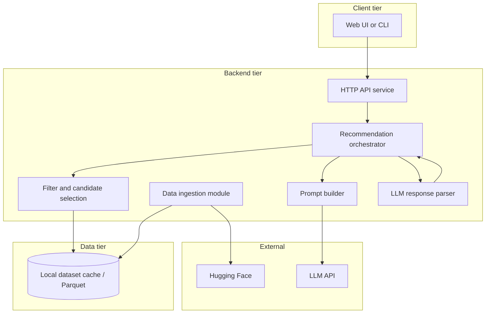
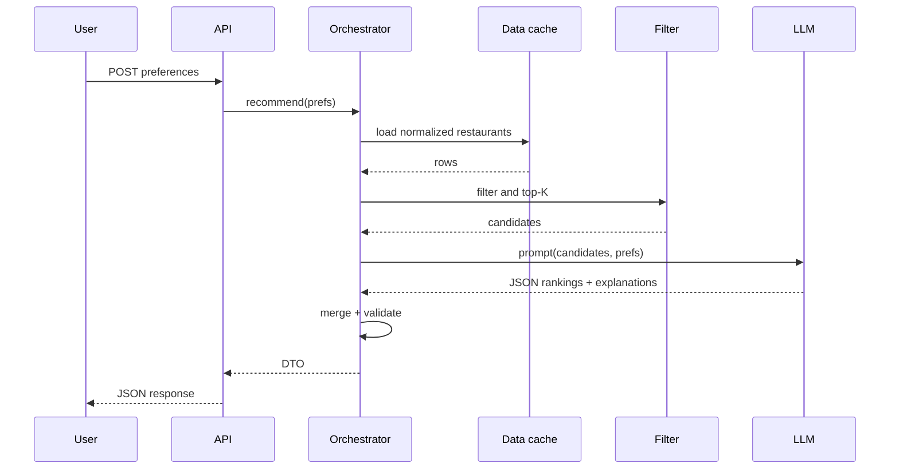
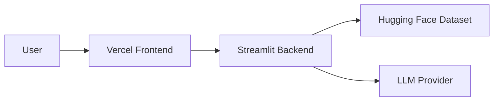

# Architecture: AI-Powered Restaurant Recommendation System

This document expands on [problemStatement.md](./problemStatement.md) with a detailed, implementation-oriented architecture. It is the primary technical blueprint for building the Zomato-inspired recommendation service.

---

### 1. Goals and constraints

#### 1.1 Product goals

- Accept user preferences (location, budget, cuisine, minimum rating, free-text extras).
- Load and use the Hugging Face dataset [ManikaSaini/zomato-restaurant-recommendation](https://huggingface.co/datasets/ManikaSaini/zomato-restaurant-recommendation).
- Combine deterministic filtering over structured rows with an LLM for ranking, explanations, and optional summary.
- Return a user-friendly list: name, cuisine, rating, estimated cost, and AI explanation per item.

#### 1.2 Technical constraints

- Grounding: Recommendations should come from rows present in the filtered candidate set passed to the LLM, to reduce hallucination.
- Cost and latency: The LLM should see a bounded number of candidates (for example 15–40), not the full dataset.
- Reproducibility: Dataset version, prompt version, and model name should be traceable (config or response metadata).

---

### 2. High-level system context



External dependencies

| Dependency | Purpose |
|------------|---------|
| Hugging Face `datasets` | Load and cache the Zomato-style dataset |
| LLM API (or local inference) | Rank candidates and generate explanations |
| Optional: object storage | Persist cached Parquet snapshots for demos |

---

### 3. System boundaries and I/O (inside vs outside the app)

This section defines everything that goes into and out of the application, and what is considered in-scope implementation vs external dependency.

#### 3.1 What is inside the app boundary

- Preference intake and validation.
- Dataset loading, normalization, filtering, shortlist creation.
- LLM prompt creation, completion parsing, response merge.
- API and/or Streamlit backend interaction layer.
- Frontend rendering (when deployed as separate web app).
- Config, observability logs, and error handling.

#### 3.2 What is outside the app boundary

- Hugging Face dataset hosting and network availability.
- LLM provider uptime, model behavior, and token pricing.
- Hosting platform infrastructure (Vercel and Streamlit cloud runtime).
- User browser/network environment.

#### 3.3 Inputs to the app

| Input type | Source | Example |
|------------|--------|---------|
| User preferences | Frontend form/API client | location, cuisine, budget, min rating, extras |
| Dataset rows | Hugging Face via `datasets` | restaurant metadata |
| Runtime configuration | `.env`, Streamlit secrets, `config.yaml` | `GROQ_API_KEY`, shortlist size |
| Infra context | Deployment platform env | region, runtime memory, process start |

#### 3.4 Outputs from the app

| Output type | Consumer | Contents |
|------------|----------|----------|
| Recommendation response | Frontend/API caller | ranked restaurants + explanations + meta |
| Health/status output | Monitoring/manual checks | service readiness, dataset readiness |
| Logs/metrics | Developer/ops | timings, failure points, candidate counts |
| User-facing messages | Frontend/UI | no results, degraded mode, validation errors |

#### 3.5 Explicit non-goals (current version)

- No persistent user account/profile storage.
- No payments, ordering, booking, or delivery workflows.
- No guaranteed real-time freshness beyond dataset refresh cycle.
- No advanced personalization history model (session memory is future scope).

---

### 4. Logical architecture (containers)

Recommended decomposition into containers (deployable or runnable units). Names are suggestions; adjust to your stack.



| Container | Responsibility |
|-----------|----------------|
| Web UI / CLI | Collect preferences; render results (name, cuisine, rating, cost, explanation). |
| HTTP API | Validate input, call orchestrator, map errors to HTTP status and messages. |
| Orchestrator | Single workflow: load or read normalized data → filter → build prompt → call LLM → parse → merge with rows for display. |
| Data ingestion | First-run (or scheduled) load from HF; normalize schema; write cache if configured. |
| Filter module | Apply structured filters; relaxation policy; cap to top-K. |
| Prompt builder | System instructions, user preference summary, tabular or JSON candidate blob. |
| LLM response parser | Parse structured output (JSON); validate IDs; handle repair/retry on malformed output. |

---

### 5. Data architecture

#### 4.1 Source dataset

- Source: `datasets.load_dataset("ManikaSaini/zomato-restaurant-recommendation", ...)`.
- Reality check: Inspect actual column names after load; map them in one place (a field mapping module or config).

#### 4.2 Canonical internal schema (target)

Define a stable internal model so filters and UI do not depend on raw HF names.

| Internal field | Description | Example use |
|----------------|-------------|-------------|
| `id` | Stable row identifier (hash of key fields or dataset index) | Merge LLM output with rows |
| `name` | Restaurant name | Display |
| `city` / `location` | Geographic filter | User location |
| `cuisines` | Normalized list or delimited string | Cuisine match |
| `rating` | Numeric where possible | Min rating, sort |
| `cost_for_two` or `price_band` | Numeric or enum | Budget mapping |
| `raw_features` | Optional: text blob for LLM (reviews snippet, known tags) | Richer explanations |

#### 4.3 Budget mapping

User supplies low / medium / high. Implement an explicit table:

- Map each band to numeric ranges aligned with your dataset (for example rupee ranges for “cost for two”).
- Document assumptions in config (YAML/JSON) so they can be tuned without code changes.

#### 4.4 Caching strategy

1. HF cache: `datasets` library default cache directory.
2. Optional normalized snapshot: After first normalization, write Parquet (or CSV) for faster startup in demos.
3. Invalidation: Tie cache file name to dataset revision or a manual `DATASET_VERSION` in config.

---

### 6. Application components (detailed)

#### 5.1 Preference input model

Validate at the API boundary (for example Pydantic):

- `location: str` — city or area; consider fuzzy match or alias map (e.g. “Bengaluru” vs “Bangalore”).
- `budget: Literal["low", "medium", "high"]`.
- `cuisine: str` — primary cuisine; optional `secondary_cuisines: list[str]`.
- `min_rating: float` — inclusive lower bound.
- `extras: str | list[str]` — free text or tags: family-friendly, quick service, etc.

Validation rules (examples)

- Clamp `min_rating` to dataset scale (e.g. 0–5).
- Reject empty `location` if your product requires it; or treat as “any” with a warning in the response.

#### 5.2 Filter and candidate selection

Steps (ordered)

1. Location filter: Exact or substring match on city/area column after normalization.
2. Rating filter: `rating >= min_rating` (handle missing ratings: exclude or impute per policy).
3. Cuisine filter: Case-insensitive match on any cuisine token in `cuisines`.
4. Budget filter: Compare mapped numeric band to row cost fields.
5. Extras (lightweight): If dataset has no structured tags, pass `extras` only to the LLM as preference text; optionally keyword-boost rows if a description column exists.

Pre-LLM ranking (deterministic)

- Sort by rating descending, then by review count or popularity if available.
- Take top K (configurable, e.g. `K=30`).

Relaxation policy (if count < K_min)

1. Widen location (same state or metro alias).
2. Relax budget one step.
3. Drop secondary cuisine requirement.
4. Lower `min_rating` in small steps with a flag `constraints_relaxed: true` in the API response.

#### 5.3 Prompt design (recommendation engine)

Objectives

- Rank only from provided candidates.
- Explain why each fits user preferences and row attributes.
- Optional: One short overall summary of the set.

Prompt structure (recommended)

1. System message: Role, rules: no restaurants outside the list; output valid JSON only; max items N.
2. User message sections:
   - Preferences: Structured bullet list from the request.
   - Candidates: JSON array or markdown table with `id`, `name`, `cuisines`, `rating`, `cost`, and any short text features.
   - Task: Return top N ordered recommendations with `id`, `rank`, `explanation` (2–4 sentences), optional `confidence`.

Example output schema (LLM)

```json
{
  "summary": "Optional one paragraph.",
  "recommendations": [
    {
      "id": "string",
      "rank": 1,
      "explanation": "string"
    }
  ]
}
```

Failure handling

- Retry once with “fix JSON” instruction if parse fails.
- If still invalid, fall back to deterministic order top N with a generic explanation template (degraded mode).

#### 5.4 Merge and response DTO

After parsing LLM JSON:

1. Join each recommendation `id` to the normalized DataFrame or dict list.
2. Build display objects:

```text
restaurant_name, cuisines, rating, estimated_cost, ai_explanation, (optional) rank
```

3. Drop any LLM item whose `id` is unknown (log for debugging).

---

### 7. API design (implemented + deployment view)

#### 7.1 Implemented backend endpoints

| Method | Path | Purpose |
|--------|------|---------|
| GET | `/health` | Service readiness and dataset load state |
| GET | `/` | Service descriptor (links/docs pointers) |
| GET | `/api/v1/locations` | Returns catalog locations from loaded dataset |
| GET | `/api/v1/cuisines` | Returns cuisine labels from loaded dataset |
| POST | `/api/v1/recommendations` | Main recommendation endpoint |
| POST | `/v1/recommendations` | Legacy-compatible alias endpoint |

#### 7.2 Request contract (`POST /api/v1/recommendations`)

```json
{
  "location": "Delhi",
  "budget_max_inr": 1500,
  "cuisine": "Italian",
  "min_rating": 4.0,
  "extras": "family-friendly, quick service",
  "secondary_cuisines": ["Mexican"]
}
```

#### 7.3 Response contract (`POST /api/v1/recommendations`)

```json
{
  "summary": "Optional LLM summary of picks.",
  "recommendations": [
    {
      "name": "Restaurant A",
      "cuisine": "Italian",
      "rating": 4.2,
      "estimated_cost": "INR 1200 for two",
      "explanation": "Fits requested cuisine, rating, and budget.",
      "rank": 1
    }
  ],
  "meta": {
    "candidates_considered": 28,
    "constraints_relaxed": false,
    "model": "provider/model-name",
    "prompt_version": "v1",
    "cuisine_resolved": null
  },
  "degraded": false,
  "message": null
}
```

#### 7.4 What the backend calls internally and externally

| Step | Called component/service | In/Out |
|------|---------------------------|--------|
| Dataset load | Hugging Face dataset via `datasets.load_dataset(...)` | Outbound |
| Candidate filtering | Phase 2 selection modules | Internal |
| LLM ranking | Groq chat completion API | Outbound |
| Merge/format | Phase 3/4 response models | Internal |
| Response delivery | API or Streamlit UI payload | Outbound to client |

#### 7.5 Error and status behavior

| Status | Meaning |
|--------|---------|
| 400/422 | Invalid preferences or schema validation failure |
| 503 | Dataset still loading, LLM unavailable, or backend runtime failure |
| 200 with empty list | Valid request but no matching candidates |

---

### 8. End-to-end sequence



---

### 9. Cross-cutting concerns

#### 8.1 Security and privacy

- Store API keys in environment variables or a secret manager; never in the repository.
- Do not log full user prompts if they may contain PII; log hashed session IDs if needed.
- Rate-limit public API endpoints if exposed.

#### 8.2 Observability

- Structured logs: `request_id`, stage timings (`load`, `filter`, `llm`), candidate count, token usage (if available).
- Metrics: latency p50/p95, LLM error rate, empty-result rate.

#### 8.3 Testing strategy

| Layer | What to test |
|-------|----------------|
| Unit | Budget mapping, cuisine normalization, filter logic, relaxation order |
| Integration | Load sample slice of dataset; end-to-end with mocked LLM returning fixed JSON |
| Manual | Spot-check explanations against actual row data for hallucinations |

---

### 10. Technology stack (suggested defaults)

| Layer | Suggested options |
|-------|-------------------|
| Language | Python 3.11+ |
| Dataset | `datasets`, `pandas` or `polars` |
| Backend runtime | Streamlit (deployment target) + existing Python orchestration modules |
| API mode (optional) | FastAPI + Uvicorn (local/dev or API-first deployments) |
| UI | Next.js frontend deployed on Vercel |
| LLM | OpenAI-compatible API, Azure OpenAI, or local (Ollama) for offline demos |
| Config | Pydantic settings + `.env` |

---

### 11. Deployment architecture

#### 11.1 Frontend deployment (Vercel)

- Deploy the frontend application to Vercel.
- Vercel serves the user-facing web UI that collects user preferences and renders recommendation results.
- Configure frontend environment variables to point API calls to the deployed backend endpoint.

#### 11.2 Backend deployment (Streamlit)

- Deploy the backend recommendation service on Streamlit.
- Streamlit hosts data loading, preprocessing, filtering, orchestration, and LLM-based recommendation generation.
- Store secrets (such as LLM API keys) in Streamlit secrets or environment configuration, not in source code.

#### 11.3 Deployment interaction flow



---

### 12. Runtime configuration and secrets

This section is the single source for required runtime settings across local and cloud deployment.

| Key | Required | Used by | Purpose |
|-----|----------|---------|---------|
| `GROQ_API_KEY` | Yes (for LLM mode) | Phase 3 client | Authenticate calls to Groq |
| `GROQ_MODEL` | No | Phase 3 client | Override default model |
| `ZOMATO_MAX_ROWS` | No | Dataset load | Cap rows loaded at startup |
| `ZOMATO_SKIP_DATASET_LOAD` | No | API mode/tests | Start service without HF load |
| `API_HOST` / `API_PORT` | No | FastAPI mode | Local API bind settings |

#### 12.1 Streamlit secrets mapping

- Configure `GROQ_API_KEY` and optional `GROQ_MODEL` in Streamlit secrets.
- Backend entrypoint maps Streamlit secrets to environment variables expected by the recommendation modules.

#### 12.2 Frontend environment contract (Vercel)

- Frontend should read backend base URL from an environment variable (for example `NEXT_PUBLIC_API_BASE_URL`).
- Build-time and runtime env configuration must point to the Streamlit backend endpoint for production.

---

### 13. Operational behavior and failure modes

#### 13.1 Startup behavior

1. Process starts on hosting platform.
2. Dataset load begins (or uses cache).
3. Service accepts requests only when dataset is ready (or returns temporary unavailable response).

#### 13.2 Known failure classes

| Failure class | Symptoms | Handling |
|---------------|----------|----------|
| Dataset fetch/network failure | Empty or delayed catalog | Return temporary failure or empty-safe response; log exception |
| Invalid user filters | Validation errors | Return 4xx-style message with field guidance |
| LLM timeout/API error | Missing ranking/explanations | Retry/fallback path; degraded response message |
| No candidate rows | Empty recommendations | Return informative message with filter relaxation hint |

#### 13.3 Reliability guidance

- Keep shortlist size bounded to protect latency and token usage.
- Use deterministic fallback ordering when LLM output is invalid.
- Expose health endpoint/state for quick diagnosis during incidents.
- Log request-scoped metadata (`request_id`, candidate count, model, latency slices).

---

### 14. Phase-wise delivery plan (detailed)

Each phase has deliverables and definition of done.

#### Phase 0 — Project skeleton

- Repository layout, `requirements.txt` or `pyproject.toml`, `.env.example`, README run instructions.
- Done: Install deps; run “health” endpoint or script.

#### Phase 1 — Data ingestion and normalization

- Loader for HF dataset; column inspection script or notebook; canonical schema + mapping.
- Optional Parquet export.
- Done: One function returns normalized in-memory table; unit test on a tiny fixture.

#### Phase 2 — Filtering and candidate selection

- Preference model; filter pipeline; relaxation; top-K.
- Done: Tests for edge cases (no rows, many rows); deterministic output without LLM.

#### Phase 3 — LLM integration

- Prompt templates (versioned); JSON parse + retry; merge layer.
- Done: Mocked LLM tests; real API smoke test in dev.

#### Phase 4 — API and UI

- `POST /v1/recommendations` (or equivalent); error handling; display all required fields.
- Done: Demo walkthrough from UI/CLI to response.

#### Phase 5 — Hardening

- Logging, config for K and model, basic rate limits if public.
- Done: Documented limits and known failure modes.

---

### 14.1 Traceability matrix (requirements → architecture)

| Problem statement item | Architecture section |
|------------------------|----------------------|
| HF Zomato dataset | §5.1, §6.1 (ingestion) |
| Extract name, location, cuisine, cost, rating | §5.2 canonical schema |
| User preferences | §6.1, §7.1 API |
| Filter and prepare data | §6.2 |
| LLM prompt for reasoning/rank | §6.3 |
| Rank, explain, summarize | §6.3, §7.1 response |
| Display name, cuisine, rating, cost, explanation | §6.4, §7.1 |

---

### 15. Future extensions (out of initial scope)

- Embeddings for semantic search over descriptions when the dataset supports it.
- User sessions and history-aware recommendations.
- A/B testing different prompt versions.
- Caching LLM responses keyed by `(prefs_hash, candidate_set_hash)` for identical requests.

---

### Document control

| Field | Value |
|-------|--------|
| Related | [problemStatement.md](./problemStatement.md) |
| Purpose | Detailed architecture and implementation guide |
| Maintainer | Project owner |

When the implementation diverges (for example actual HF column names), update §5.2 and the field mapping module first, then adjust filters and prompts accordingly.
